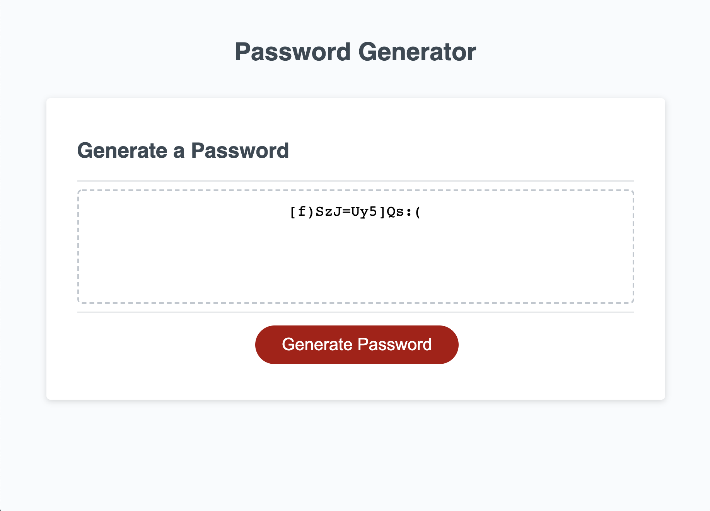

# password-generator

## Description

Secure passwords are crucial to ensuring the privacy of one's information! Individuals and companies alike can use this web application to create random passwords that suit their preference.

The goal for this website is to collect user input through prompts and confirms, and output a password based on the user's specification. Javascript is used to query the user and construct the password. Using DOM manipulation, the resulting password is displayed on screen.

## Usage

View the deployed [Password Generator](https://roccomaniscalco.github.io/password-generator/) to create a custom password.

### User Input

1.  Press generate password
2.  Input a password length in the range `[0-250]`
3.  Accept or decline the inclusion of...
    *   lowercase letters
    *   uppercase letters
    *   digits
    *   special characters

## Installation

1.  Head to the [password-generator repository](https://github.com/roccomaniscalco/password-generator)
2.  Click the green code button and select method of download
3.  Open the downloaded Responsive Portfolio repository with your choice of text-editor or IDE

## Credits

* starting files provided by [Jonathon Watson](https://github.com/jonathanjwatson)

## License
password-generator license

Copyright (c) 2020 Rocco Maniscalco

Permission is hereby granted, free of charge, to any person obtaining a copy
of this software and associated documentation files (the "Software"), to deal
in the Software without restriction, including without limitation the rights
to use, copy, modify, merge, publish, distribute, sublicense, and/or sell
copies of the Software, and to permit persons to whom the Software is
furnished to do so, subject to the following conditions:

The above copyright notice and this permission notice shall be included in all
copies or substantial portions of the Software.

THE SOFTWARE IS PROVIDED "AS IS", WITHOUT WARRANTY OF ANY KIND, EXPRESS OR
IMPLIED, INCLUDING BUT NOT LIMITED TO THE WARRANTIES OF MERCHANTABILITY,
FITNESS FOR A PARTICULAR PURPOSE AND NONINFRINGEMENT. IN NO EVENT SHALL THE
AUTHORS OR COPYRIGHT HOLDERS BE LIABLE FOR ANY CLAIM, DAMAGES OR OTHER
LIABILITY, WHETHER IN AN ACTION OF CONTRACT, TORT OR OTHERWISE, ARISING FROM,
OUT OF OR IN CONNECTION WITH THE SOFTWARE OR THE USE OR OTHER DEALINGS IN THE
SOFTWARE.